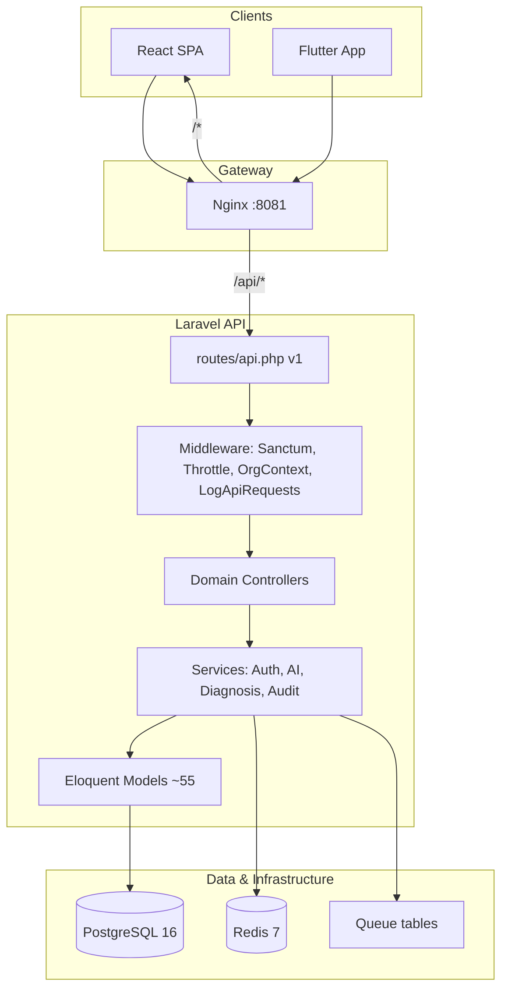
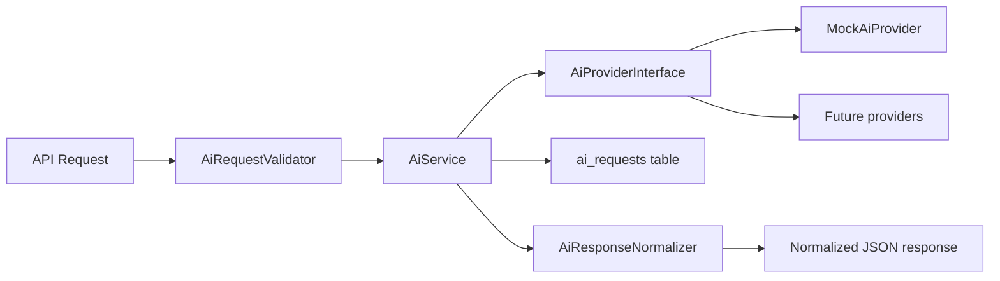

# WSA Enterprise Architecture & Core Platform v1.0

**Version:** 1.0  
**Status:** Authoritative architecture reference  
**Last updated:** August 2026  
**Repository:** WSA-Enterprise (Laravel 12 + React 19 + Flutter)

---

## 1. System overview

WSA-Enterprise is a **multi-tenant agricultural enterprise platform** delivered as a modular monolith. A single Laravel API serves web (React) and mobile (Flutter) clients. Business rules, authorization, tenant isolation, and domain workflows live in the backend; clients are thin presentation layers.

### Design principles (v1.0)

| Principle | Implementation |
|-----------|----------------|
| Backend as source of truth | Validation, RBAC, tenancy, workflows in Laravel |
| Modular monolith | Domain-grouped controllers/services, shared PostgreSQL |
| Row-level multi-tenancy | `organization_id` on tenant-scoped tables |
| Incremental enterprise patterns | Add audit, envelopes, middleware without rewrites |
| Backward compatibility | Existing API shapes preserved; new patterns opt-in |
| Provider abstraction | AI via `AiProviderInterface`, not hard-coded vendor |

---

## 2. Architecture diagram



---

## 3. Backend architecture

### 3.1 Layer model

| Layer | Location | Responsibility |
|-------|----------|----------------|
| **Routes** | `routes/api.php` | Versioned HTTP surface (`/api/v1/*`) |
| **Middleware** | `app/Http/Middleware/` | Auth, logging, organization context |
| **Controllers** | `app/Http/Controllers/Api/` | HTTP adapters, orchestration |
| **Concerns** | `app/Http/Controllers/Concerns/` | Tenancy, authorization, pagination |
| **Form requests** | `app/Http/Requests/` | Input validation (auth, AI, diagnosis) |
| **Services** | `app/Services/` | Domain/application logic |
| **Models** | `app/Models/` | Persistence, relationships |
| **Policies** | `app/Policies/` | Model-level authorization (Farm, Business) |
| **Support** | `app/Support/` | Cross-cutting helpers (`ApiResponse`) |
| **Contracts** | `app/Contracts/` | Interfaces (`AiProviderInterface`) |

### 3.2 Controller patterns

1. **Dedicated controllers** — Auth, Dashboard, Projects, Tasks, Diagnosis requests, Training enrollments, AI, Platform, Audit.
2. **Module-dispatch controllers** — Farm, Crop, Soil, Directory, Catalog, Operations, Commerce, Library, Training (CRUD modules via `MODULES` map).

### 3.3 API versioning

- Current version: **`/api/v1`**
- Health: `GET /api/v1/health`, Laravel: `GET /up`
- Breaking changes require `/api/v2`; v1 maintained for client compatibility.

### 3.4 API response conventions

| Pattern | Format | Usage |
|---------|--------|-------|
| Legacy success | Raw JSON model/array | Most existing endpoints |
| Envelope (v1.0+) | `{ "data": …, "meta": …? }` | Audit logs, new endpoints via `ApiResponse` |
| Validation error | `{ "message", "errors" }` | 422 |
| HTTP errors | `{ "message" }` | 4xx/5xx via `bootstrap/app.php` |
| Delete success | `204 No Content` | Destroy actions |

### 3.5 Error handling

Centralized in `bootstrap/app.php` for `api/*` routes: JSON errors for 404, 422, and HTTP exceptions. `LogApiRequests` middleware records structured request logs.

---

## 4. Domain / module boundaries

| Domain | API prefix / routes | Key tables | Permissions |
|--------|---------------------|------------|-------------|
| **Identity / Auth** | `/auth/*`, `/user` | `users`, `personal_access_tokens` | Public + Sanctum |
| **Organizations / Tenants** | `/platform/organizations` | `organizations`, `organization_user` | Membership |
| **Users / Roles / Permissions** | `/users`, `/roles`, `/permissions`, `/audit-logs` | `roles`, `permissions`, pivots, `audit_logs` | `access.manage` |
| **Projects / Tasks** | `/projects`, `/tasks` | `projects`, `tasks` | `platform.view` |
| **Directory** | `/directory/{module}` | `companies`, `branches`, `employees` | `business.*` |
| **Catalog** | `/catalog/{module}` | `customers`, `products`, etc. | `business.*` |
| **Operations** | `/operations/{module}` | inventory, purchase orders | `business.*` |
| **Commerce** | `/commerce/*` | sales, invoices, notifications | `business.*`, `platform.view` |
| **Farms** | `/farm/{module}` | `farms`, `farm_fields`, `irrigation_zones`, … | `farm.*` |
| **Fields** | `/farm/farm-fields`, blocks, regions | farm sub-entities | `farm.*` |
| **Crops** | `/crop/{module}` | `crop_types`, `crop_seasons`, yields | `crop.*` |
| **Soil** | `/soil/{module}` | `soil_analyses`, nutrients | `soil.*` |
| **Irrigation** | `/farm/irrigation-zones` | `irrigation_zones` | `farm.*` |
| **Diagnosis** | `/diagnosis/*` | diagnosis taxonomy + requests | `diagnosis.*` |
| **Training** | `/training/*` | courses, lessons, enrollments | `training.*` |
| **Library / Knowledge** | `/library/*` | categories, items, tags | `library.*` |
| **AI** | `/ai/*` | `ai_requests` | `ai.use` |
| **Notifications** | `/commerce/notifications` | `app_notifications` | `platform.view` |
| **Files / Media** | References via `MediaReferenceService` | Path sanitization | Domain-specific |
| **Audit** | `/audit-logs` | `audit_logs` | `access.manage` |
| **Reporting** | Dashboard + workflow summary | Aggregations | `platform.view` |

---

## 5. Multi-tenancy model

| Aspect | Detail |
|--------|--------|
| Model | Shared database, shared schema |
| Isolation key | `organization_id` on ~50 tables |
| Resolution | `X-Organization-Id` header → membership check → fallback to first org |
| Middleware | `ResolveOrganizationContext` binds org once per request |
| Trait | `ResolvesOrganization` in controllers |
| FK validation | `OrganizationScopeValidator`, `AgriculturalScopeValidator` |
| Membership roles | Pivot `organization_user.role`: `admin` (full), `member` (baseline) |
| Custom RBAC | Per-org `roles` + `permissions` assignments |

**Security:** Cross-tenant access returns **403**; foreign resource IDs return **404**. Verified in Phase 8 tests.

---

## 6. Authentication & authorization

### Authentication

- **Laravel Sanctum** bearer tokens for API clients
- Registration disabled by default (`ALLOW_REGISTRATION=false`)
- Configurable token expiration (`SANCTUM_TOKEN_EXPIRATION`)
- Stateful domains for Vite dev (`localhost:5173`); Docker nginx uses bearer tokens

### Authorization

- **Primary:** `PermissionService` + `authorizePermission()` in controllers
- **Catalog:** `config/permissions.php` (18 permissions: `{domain}.{view|manage|use}`)
- **Cache:** 60s per user+org; invalidated on role assignment (v1.0)
- **Policies:** `FarmPolicy`, `BusinessPolicy` (registered; controllers use string permissions today)

### Client headers

```
Authorization: Bearer {token}
X-Organization-Id: {organization_id}
Accept: application/json
```

---

## 7. React architecture

```
frontend/src/
├── main.tsx           # BrowserRouter entry
├── App.tsx            # Routes, ProtectedShell, SessionGuard
├── api.ts             # Fetch client, types, CRUD helpers
├── context/AuthContext.tsx
├── components/        # AppShell, OrgSwitcher, RecordForm, ConfirmDialog
└── pages/             # Dashboard, ModulePage (generic), workflow pages
```

| Concern | Pattern |
|---------|---------|
| Routing | React Router v7, protected routes |
| Auth | Context + localStorage (`wsa_token`, `wsa_user`, `wsa_organization_id`) |
| API | Same-origin `/api/v1` via Nginx |
| Modules | Config-driven tabs in `ModulePage` for farm/crop/soil |
| Errors | `ApiError`, 401 → session redirect, 403 banners |
| State | React Context (no Redux); local component state |

---

## 8. Flutter architecture

```
mobile/lib/
├── main.dart              # Bootstrap, login, theme
├── api/api_client.dart    # HTTP + session (mirrors web api.ts)
├── screens/
│   ├── home_screen.dart   # Drawer + bottom nav
│   ├── module_screens.dart
│   └── feature_screens.dart
└── widgets/               # org_switcher, record_form, async_state
```

| Concern | Pattern |
|---------|---------|
| Navigation | In-memory `AppModule` enum (drawer + bottom bar) |
| Auth | `shared_preferences`, same keys as web |
| API | `--dart-define=API_URL` (default port should match Docker) |
| Parity | All 9 modules, org switcher, CRUD, 401/403 handling |

---

## 9. AI architecture



| Component | Role |
|-----------|------|
| `AiProviderInterface` | Provider contract (`complete(requestType, input)`) |
| `MockAiProvider` | Default dev/test provider |
| `AiService` | Orchestration, timeout, persistence, failure handling |
| `AiRequestValidator` | Request-type input validation |
| `AiResponseNormalizer` | Consistent output shape |
| `ai_requests` | Audit trail: status, latency, tokens, I/O JSON |
| `DiagnosisWorkflowService` | Domain workflow consuming AI service |

**Extensibility:** Register new providers in `AppServiceProvider`; configure via `AI_PROVIDER` env. No domain controller calls a vendor SDK directly.

**Future (not v1.0):** Queue long-running AI jobs via `ProcessAiRequest` job (foundation in v1.0); webhook/poll completion.

### Queue foundation (v1.0)

| Component | Purpose |
|-----------|---------|
| `ProcessAiRequest` job | Async processing of `ai_requests` records |
| `AiService::processRecord()` | Shared sync/async execution path |
| `config/ai.php` | `AI_QUEUE`, `AI_QUEUE_TRIES`, timeout settings |
| Redis + `jobs` table | Laravel queue infrastructure (worker not in default Compose) |

---

## 10. Database architecture

- **Engine:** PostgreSQL 16 (SQLite in CI unit contexts)
- **Migrations:** 28 files (Phase 4–12 domain + enterprise + monitoring); do not rewrite historical migrations
- **Indexing:** Phase 6 performance indexes on diagnosis, library, training, AI, farms
- **Queues:** `jobs`, `failed_jobs`, `job_batches` tables; `queue` worker service in Docker Compose
- **Monitoring:** `monitoring_events` table (Phase 12 M12.4)
- **Tenant boundary:** `organization_id` FK on tenant tables; validate cross-FK in controllers

See `docs/database.md` for table inventory by phase.

---

## 11. Events, jobs, and queues

| Capability | v1.0 / M12 status |
|------------|-------------------|
| Queue tables | Migrated |
| Redis queue driver | Configured (`QUEUE_CONNECTION=redis`) |
| Docker `queue` service | Runs `php artisan queue:work` |
| Docker `scheduler` service | Runs `php artisan schedule:work` (M13.1 heartbeat) |
| `ProcessAiRequest` job | Async AI processing (Phase 10+) |
| Domain events/listeners | Not yet introduced |

---

## 12. Notifications

- **In-app:** `app_notifications` table, Commerce controller
- **Laravel notifications:** Not yet wired to email/push
- **Broadcasting:** `log` driver (placeholder)

---

## 13. Files and media

- `MediaReferenceService` sanitizes storage paths
- No dedicated media upload pipeline in v1.0
- `storage/` bind-mounted in Docker for Laravel files

---

## 14. Audit and logging

| Layer | Mechanism |
|-------|-----------|
| Request logging | `LogApiRequests` middleware |
| AI audit | `ai_requests` table |
| Change audit (v1.0) | `audit_logs` table + `AuditService` |
| Model audit | `Auditable` trait on selected models (e.g. `Role`) |
| Access audit | Explicit logs for role assignment |
| Auth audit (v1.0+) | `auth.login`, `auth.login_failed`, `auth.logout`, `auth.register` |
| API | `GET /api/v1/audit-logs` (envelope response, `access.manage`) |

Sensitive fields (`password`, `token`, etc.) are stripped before persistence.

---

## 15. Security model

Documented in `docs/security.md`. Summary:

- Sanctum tokens, bcrypt passwords, rate limits (20/min auth, 120/min API)
- Tenant isolation + permission checks on every mutating endpoint
- Registration lockdown, sanitized `/user` endpoint
- CORS via `config/cors.php` — production origins from comma-separated `FRONTEND_URL` (M13.4)
- Phase 8 security test suite

---

## 16. Testing strategy

| Layer | Tooling | Scope |
|-------|---------|-------|
| Backend | PHPUnit 11 | Module, E2E workflow, security, regression, Phase 11–13 ops |
| Frontend | Vitest + Vite build (CI) | API client helpers, login demo gating, TypeScript compile |
| Mobile | flutter analyze + test | API client, widget smoke |
| E2E | API workflow tests | Phase 7/8 comprehensive tests |
| Manual | `docs/e2e-testing.md` | Browser/mobile when available |

Run locally:

```bash
cd backend && php artisan test
cd frontend && npm run build
cd mobile && flutter analyze && flutter test
```

---

## 17. Docker and deployment architecture

| Service | Image | Port | Role |
|---------|-------|------|------|
| nginx | nginx:1.27-alpine | **8081→80** | Gateway: `/api` → PHP-FPM, `/` → React |
| backend | PHP 8.4 FPM | 9000 internal | Laravel |
| frontend | Node build + nginx | 80 internal | Static SPA |
| postgres | postgres:16-alpine | 5432 | Primary DB |
| redis | redis:7-alpine | 6379 | Cache, sessions, queues |

Bootstrap: `scripts/staging-bootstrap.ps1` / `.sh`

See `docs/deployment.md` for production checklist. **Production stack (M12–M13):** TLS via Certbot, `queue` + `scheduler` services, health probes, optional certbot nginx reload hook — see [operations-monitoring.md](operations-monitoring.md).

---

## 18. Architectural decisions (ADR summary)

| ID | Decision | Rationale |
|----|----------|-----------|
| ADR-001 | Modular monolith over microservices | Faster delivery, simpler ops for MVP |
| ADR-002 | Row-level tenancy | Fits PostgreSQL, simpler than schema-per-tenant |
| ADR-003 | String permissions in controllers | Matches generic module controllers; policies for specific models |
| ADR-004 | Module-dispatch CRUD | DRY for 30+ similar agricultural/ERP entities |
| ADR-005 | Bearer tokens for SPA/mobile | Simpler than cookie CSRF through nginx gateway |
| ADR-006 | AI provider interface | Swap mock/production providers without domain changes |
| ADR-007 | Incremental API envelope | `ApiResponse` for new endpoints; no breaking migration |
| ADR-008 | Audit log table (v1.0) | Compliance foundation without event-sourcing complexity |

---

## 19. Current limitations

1. AI requests processed synchronously in HTTP cycle by default (`AI_ASYNC_DISPATCH=false`)
2. API responses mostly raw Eloquent JSON (envelope adoption incremental)
3. No global Eloquent tenant scope (manual `organization_id` queries)
4. Frontend API layer monolithic (`api.ts`); no generated OpenAPI client
5. Flutter uses in-memory navigation (no deep links)
6. Update CRUD exists in API clients but not fully exposed in UI

**Resolved in Phase 9 gap closure:** Docker Compose includes a dedicated `queue` worker; port documentation aligned on **8081** (staging) and **5173** (Vite dev).

**Phase 10 (production platform):** Isolated test database (`wsa_enterprise_test`), SPA nginx fallback, async AI lifecycle (`pending` → `processing` → `completed`/`failed`), expanded audit events, modular frontend/mobile API clients, OpenAPI CI validation.

---

## 20. Future evolution plan

| Phase | Focus |
|-------|-------|
| **v1.1** | Async AI dispatch opt-in (`AI_ASYNC_DISPATCH`), polling endpoint, expanded audit |
| **v1.2** | Global tenant scope trait; expand `Auditable` to commerce/inventory |
| **v1.3** | Domain events for order/diagnosis completion; notification channels |
| **v2.0** | `/api/v2` if breaking changes required; optional read replicas |

---

## 21. Related documentation

| Document | Purpose |
|----------|---------|
| `docs/security.md` | Security controls |
| `docs/deployment.md` | Docker and production |
| `docs/database.md` | Schema reference |
| `docs/e2e-testing.md` | Test procedures |
| `docs/testing.md` | Isolated PHPUnit, CI, staging smoke tests |
| `docs/production-readiness.md` | Staging vs production gaps |
| `docs/phase8.md` | Phase 8 delivery notes |
| `docs/api-conventions.md` | HTTP API response and auth conventions |
| `docs/openapi.yaml` | OpenAPI 3.1 foundation for key endpoints |

---

*This document is the authoritative architecture reference for WSA Enterprise Core Platform v1.0.*
