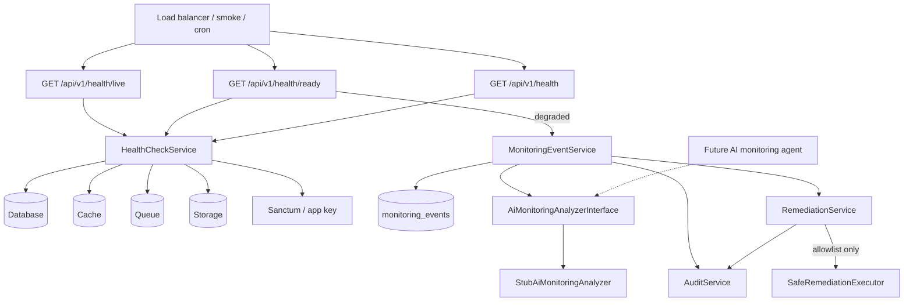

# Phase 12 M12.4 — AI Monitoring & Health Checks

**Status:** Implemented (pending review)  
**Branch:** `phase-12-m12-4-ai-monitoring-health-checks`  
**Baseline:** M12.2 (#15) and M12.3 (#17) merged on `main`

---

## Objective

Establish a secure foundation for continuous platform monitoring and AI-assisted health checks. This milestone does **not** implement the customer AI assistant or agricultural image diagnosis — it provides the monitoring, incident, and safe-remediation architecture those future services will plug into.

---

## Architecture Overview



### Core components

| Component | Location | Responsibility |
|-----------|----------|----------------|
| `HealthController` | `backend/app/Http/Controllers/Api/HealthController.php` | Public liveness, readiness, and legacy health endpoints |
| `HealthCheckService` | `backend/app/Services/Monitoring/HealthCheckService.php` | Dependency probes for platform monitoring |
| `MonitoringEvent` | `backend/app/Models/MonitoringEvent.php` | Structured incident records |
| `MonitoringEventService` | `backend/app/Services/Monitoring/MonitoringEventService.php` | Detection, analysis, resolution, escalation |
| `AiMonitoringAnalyzerInterface` | `backend/app/Contracts/AiMonitoringAnalyzerInterface.php` | Analysis-only contract for future AI agent |
| `StubAiMonitoringAnalyzer` | `backend/app/Services/Monitoring/StubAiMonitoringAnalyzer.php` | Deterministic stub until AI agent is wired |
| `RemediationService` | `backend/app/Services/Monitoring/RemediationService.php` | Allowlist enforcement and audit logging |
| `SafeRemediationExecutor` | `backend/app/Services/Monitoring/SafeRemediationExecutor.php` | Executes predefined safe actions only |
| `config/monitoring.php` | `backend/config/monitoring.php` | Feature flags and remediation allowlist |

---

## Health Endpoints

| Endpoint | Purpose | HTTP when healthy | HTTP when degraded |
|----------|---------|-------------------|---------------------|
| `GET /api/v1/health/live` | Process liveness (no dependency checks) | 200 | N/A (always 200) |
| `GET /api/v1/health/ready` | Readiness — DB, cache, queue, storage, scheduler, auth | 200 | 503 |
| `GET /api/v1/health` | **Backward compatible** smoke/legacy check | 200 `{status:"ok"}` | 503 `{status:"degraded", checks:{...}}` |

### Readiness checks

- **database** — `SELECT 1`
- **cache** — write/read/forget probe key
- **queue** — connection availability (sync driver reports in-process)
- **storage** — local disk write/read/delete probe
- **scheduler** — external heartbeat optional (passes with advisory message if absent)
- **authentication** — Sanctum tokens table + application key
- **application** / **api** — bootstrap and routing layer markers

Failed readiness probes optionally create monitoring incidents (`MONITORING_RECORD_INCIDENTS`, default `true`).

---

## Monitoring Flow

1. Probe hits `/health/ready` or legacy `/health`.
2. `HealthCheckService` runs component checks.
3. If degraded and recording is enabled, `MonitoringEventService::recordReadinessFailures()` creates one incident per failed component.
4. Each incident is immediately analyzed via `AiMonitoringAnalyzerInterface` (stub today).
5. Analysis is persisted on the event and written to `audit_logs`.
6. Optional automatic remediation runs only when `MONITORING_AUTO_REMEDIATION=true` and the recommended action is allowlisted and not high-risk.

---

## Incident Lifecycle

```
detected → analyzed → remediation_attempted → verified → resolved
                 ↘ escalated (human approval required)
```

### `monitoring_events` fields

| Field | Description |
|-------|-------------|
| `component` | Failed subsystem (e.g. `database`, `cache`) |
| `status` | `open` or `resolved` |
| `severity` | `info`, `warning`, `critical` |
| `lifecycle_stage` | Current stage in the lifecycle |
| `detected_at` / `resolved_at` | Timestamps |
| `details` | JSON error/reference payload |
| `remediation_status` | e.g. `pending`, `attempted`, `succeeded`, `escalated` |
| `remediation_action` | Allowlisted action name |
| `request_id` / `correlation_id` | Traceability |

---

## AI Monitoring Boundaries

The AI monitoring agent (future) may:

- Analyze health failures and correlate repeated incidents
- Recommend remediation actions from the allowlist
- Execute **only** allowlisted actions when auto-remediation is explicitly enabled

The AI monitoring agent must **never**:

- Execute arbitrary shell commands or arbitrary code
- Run destructive database operations
- Delete production data
- Bypass the remediation allowlist

High-risk actions (e.g. `incident.escalate` when invoked automatically) require human approval.

All detection, analysis, remediation attempts, and results are recorded via `AuditService` with actions such as:

- `monitoring.incident.detected`
- `monitoring.incident.analyzed`
- `monitoring.remediation.attempted` / `.succeeded` / `.failed` / `.rejected`

---

## Safe Remediation Model

Configured in `config/monitoring.php`:

```php
'allowed_remediation_actions' => [
    'cache.clear_probe_keys',
    'health.rerun_checks',
    'incident.mark_analyzed',
    'incident.escalate',
    'incident.resolve',
],
```

`RemediationService::execute()` rejects any action not on this list and logs `monitoring.remediation.rejected`.

---

## Future Extension Points

| Future capability | Extension hook |
|-------------------|----------------|
| AI monitoring agent | Implement `AiMonitoringAnalyzerInterface` with LLM-backed analysis |
| Customer AI assistant | Reuse audit + incident model; separate service namespace |
| Agricultural image diagnosis | Attach diagnosis failures as `component: diagnosis_pipeline` incidents |
| Frontend availability | Optional HTTP probe via env-configured URL in `HealthCheckService` |
| Scheduler heartbeat | Write `healthcheck:scheduler:last_run` from cron for stricter scheduler check |
| Operator dashboard | Read `monitoring_events` + `audit_logs` filtered by `monitoring.*` actions |

---

## Configuration

| Variable | Default | Description |
|----------|---------|-------------|
| `MONITORING_ENABLED` | `true` | Master switch for incident recording |
| `MONITORING_RECORD_INCIDENTS` | `true` | Create incidents on readiness failure |
| `MONITORING_AUTO_REMEDIATION` | `false` | Allow automatic safe remediation |

---

## Verification

See [phase-12-m12-4-verification.md](phase-12-m12-4-verification.md).

**Suggested commit message:** `Add AI monitoring foundation with health probes and safe remediation.`
